# Huddle

**Table of content**

TODO

## Teams

### Admin configure

### Add Teams

Excel & power shell

Global Team

## Import and publish LUIS App

### Import LUIS App

1. Open [https://www.luis.ai/](https://www.luis.ai/),and sign in.

2. Finish or skip the welcome page. Then go to the applications page:

   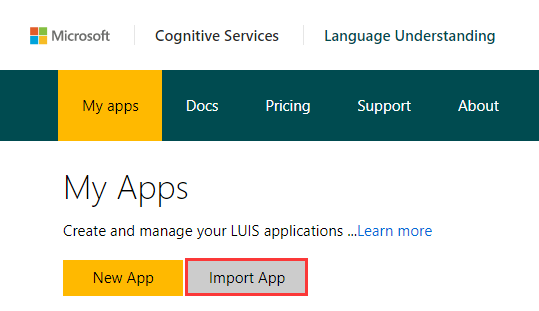

3. Click **Import App**.

   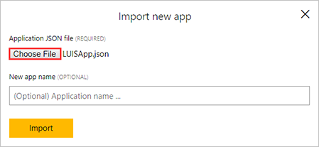

   * Click**Choose File**, and *select /Files/* *LUISApp.json*.
   * Click**Import**. 

   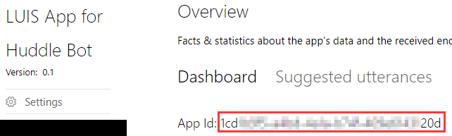

4. Copy aside the **App Id**. It will be used as the value of the **Luis App Id** parameter of the ARM Template.

### Set application as public

1. Click **Settings**. 

   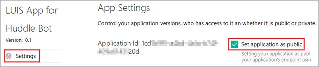

2. Check **Set application as public**. 

   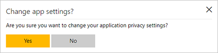

3. Click **Yes**.

### Train and  Publish the App

1. Click **Train& Test** at the left.

   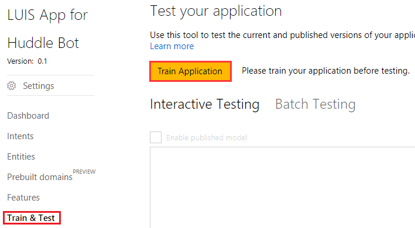

   Click **Train Application**.

2. Click **Publish App** at the left.

   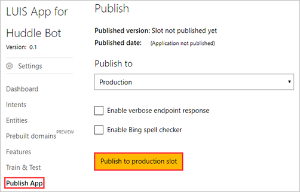

3. Click **Publish to production slot**.

## Create and configure Bot

### Create a Bot

1. Open [https://dev.botframework.com](https://dev.botframework.com) in browser, then sign in with a workaccount.

   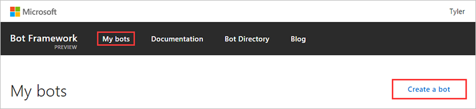

2. Click **My bots**, then click **Create a bot**.

   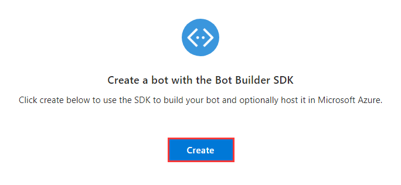

3. Click **Create**

   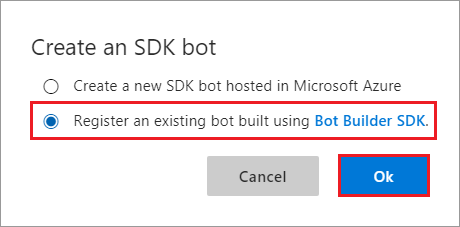

4. Select **Register an existing bot built using Bot Builder SDK**. hen click **Ok**.

### Customize and Configure the Bot

1. Upload icon:

   

   Click **Upload custom icon**, then select /Files/*HuddleBotIcon.png*.

2. Input the fields:

   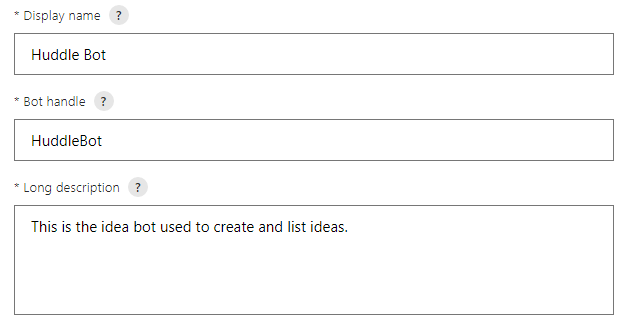

   * **Display name**: Huddle Bot
   * **Bot handle**: HuddleBot*<Prefix>*
   * **Long description**: This is the idea bot used to create and list ideas 

   > Note: 
   >
   > - **Bot handle** should be unique, please add some suffix to avoid confliction.
   > - **Bot handle** will be used as the value of **Bot Id** parameter of the ARM Template. Please copy it aside.

3. Leave **Message endpoint** empty

   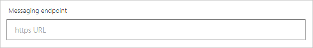

4. Configure Microsoft App

   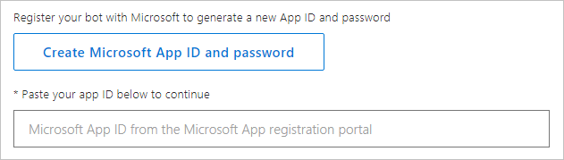

   Click **Create Microsoft App ID and password**.

   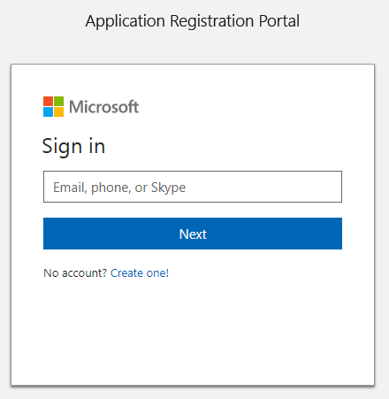

   Login in with the work account.

   An app will be created automatically:

   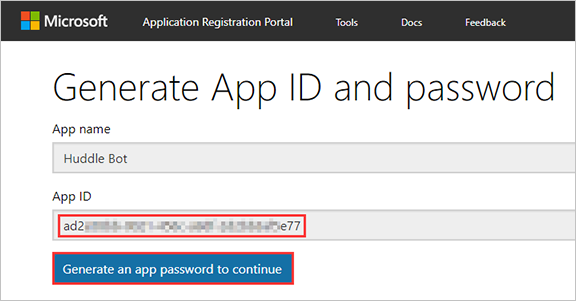

   Copy aside the App ID. It will be used as the value of **MicrosoftAppId** App setting. It will also be used in the Teams App **manifest.json** file as id and botId.

   Then click **Generate an app password to continue**.

   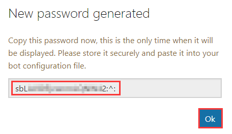

   Copy aside the password, It will be used as the value of **MicrosoftAppPassword **App setting.

   Then click **OK**.

   Click **Finish** and go back to Bot Framework.

   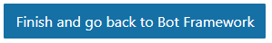

5. Skip **Analytics** and **Admin** sections.

6. Go to the end of the page:

   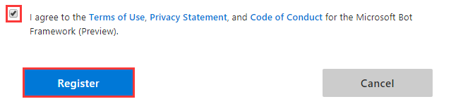

   Check thecheckbox, and click **Register**.

   > Note: Ifyou got error of the Bot handle: Id is already in use. Please use another one.

7. Click **OK**. 

   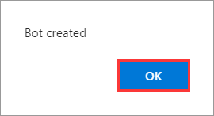

### Add Microsoft Teams Channel

1. Click the **Microsoft Teams Icon** under **Add a channel** section.

   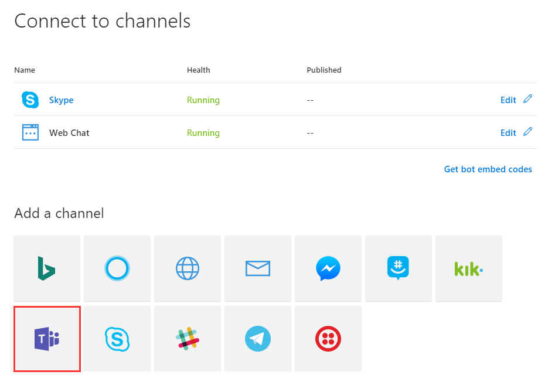

2. Click **Done**

   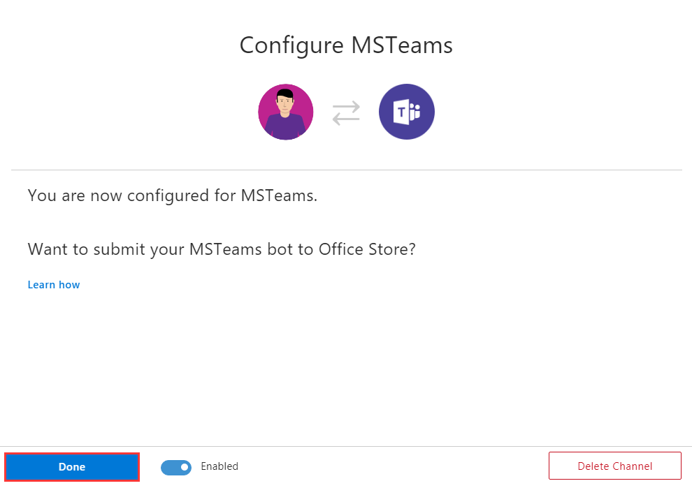

3. Right click the new added **Microsoft Teams** channel.

   

   Click **Copy link address**, and paste the URL to someplace. It will be used to add the Bot to Microsoft Teams later.

## Create SharePoint Site and Lists

## Generate a self-signed certificate

### Generate a new self-signed certificate

Run PowerShell as administrator, then execute the commands below:

~~~powershell
$cert = New-SelfSignedCertificate -Type Custom –KeyExportPolicy Exportable -KeySpec Signature -Subject "CN=Huddle App-only Cert" -NotAfter (Get-Date).AddYears(20) -CertStoreLocation "cert:\CurrentUser\My" -KeyLength 2048
~~~

> Note: please keep the PowerShell window open until you finish the steps below.

### Get keyCredentialkey

Execute the commands below to get keyCredential:

Feel free to change the file path at the end of the command.

~~~powershell
$keyCredential = @{}
$keyCredential.customKeyIdentifier = [System.Convert]::ToBase64String($cert.GetCertHash())
$keyCredential.keyId = [System.Guid]::NewGuid().ToString()
$keyCredential.type = "AsymmetricX509Cert"
$keyCredential.usage = "Verify"
$keyCredential.value = [System.Convert]::ToBase64String($cert.GetRawCertData())
$keyCredential | ConvertTo-Json > c:\keyCredential.txt
~~~

The keyCredential is in the generated file, and will be used to create App Registrations in AAD.

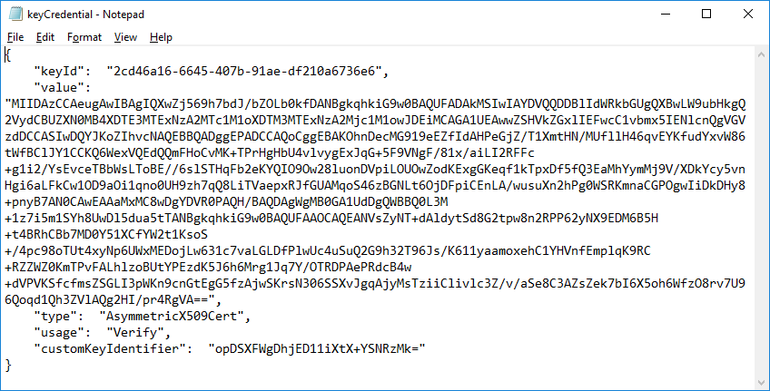

### Export the certificate and convert to base64 string

The following commands will export the certificate and convert it to base64 string.

~~~powershell
$password = Read-Host -Prompt "Enter password" -AsSecureString
$bytes = $cert.Export([System.Security.Cryptography.X509Certificates.X509ContentType]::Pfx, $password)
[System.Convert]::ToBase64String($bytes) | Out-File 'c:\cert-base64.txt'
~~~

You will be prompted to input a password to protect the certificate. Please copy aside the password. It will be used as the value of the **Certificate Pfx Password** parameter of the ARM Template

The base64 string of the certificate is in the generated text file, and will be used as the value of the **Certificate Pfx Base64** parameter of the ARM Template.

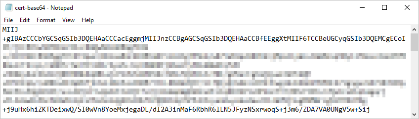

## Create App Registrations in AAD 

### Get Tenant Id

1. Open the AAD in Azure Portal, then get the **Directory ID**.

   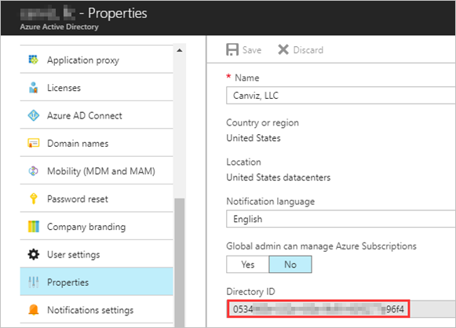

   ​	The **Directory ID** will be used as the value of **Tenant Id** parameter of the ARM Template.

### Create App Registration for the Bot Web App

2. Create a new App Registration:

   * Name: Huddle Bot Web App
   * Application Type: Web app/API
   * Sign-on URL: https://huddle/bot-web-app
   * Permissions:
      | API                                      | Permission Type | Permissions                              |
      | ---------------------------------------- | --------------- | ---------------------------------------- |
      | Office 365 SharePoint Online  (Microsoft.SharePoint) | Application     | Read and write items and lists in all site  collections |
      | Microsoft  Graph                         | Delegated       | Read and  all groups Read  all users’ full profiles |

3. Copy aside the **Application Id**. It will be used as the values of **Bot Client Id** parameter of the ARM Template.

4. Create a new Key and copy aside its value. The key value will be used as the value of **Bot Client Secret** parameter of the ARM Template.

### Create App Registration for the Metric Web App

1. Create a new App Registration \:

   * Name: Huddle Metric Web App

   * Application Type: Web app/API

   * Sign-on URL: https://huddle/metric-web-app

   * Permissions:

      | API                                      | Permission Type | Permissions                              |
      | ---------------------------------------- | --------------- | ---------------------------------------- |
      | Office 365 SharePoint Online  (Microsoft.SharePoint) | Application     | Read and write items and lists in all site  collections |
      | Windows Azure Active Directory (Microsoft.Azure.ActiveDirectory) | Delegated       | Read directory data Sign in and read user profile |

2. Copy aside the **Application Id**. It will be used as the values of **Metric Client Id** parameter of the ARM Template.

3. Create a new Key and copy aside its value. The key value will be used as the value of **Metric Client Secret** parameter of the ARM Template.

### Create App Registration for the Metric Web App

1. Create a new App Registration:

   * Name: Huddle MS Graph Connector
   * Application Type: Web app/API
   * Sign-on URL: https://huddle/ms-graph-connector
   * Permissions:
      | API             | Permission Type | Permissions                              |
      | --------------- | --------------- | ---------------------------------------- |
      | Microsoft Graph | Delegated       | Read and write all groups Read all users’ full profiles |

2. Copy aside the **Application Id**. It will be used as the values of **Graph Client Id** parameter of the ARM Template.

3. Create a new Key and copy aside its value. The key value will be used as the value of **Graph Client Secret** parameter of the ARM Template.

### Add keyCredential to App Registrations of the Bot Web App and Metric Web App

1. Open a App Registration

   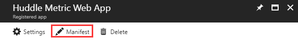

2. Click **Manifest**

   

3. Insert the keyCredential into the square bracketsof **keyCredentials** node.
4. Click **Save**.

## Deploy Azure Components with ARM Template

### GitHub Authorize

1. Generate Token

   - Open [https://github.com/settings/tokens](https://github.com/settings/tokens) in your web browser.

   - Sign into your GitHub account where you forked this repository.

   - Click **Generate Token**

   - Enter a value in the **Token description** text box

   - Select the following s (your selections should match the screenshot below):

     - repo (all) -> repo:status, repo_deployment, public_repo
     - admin:repo_hook -> read:repo_hook

     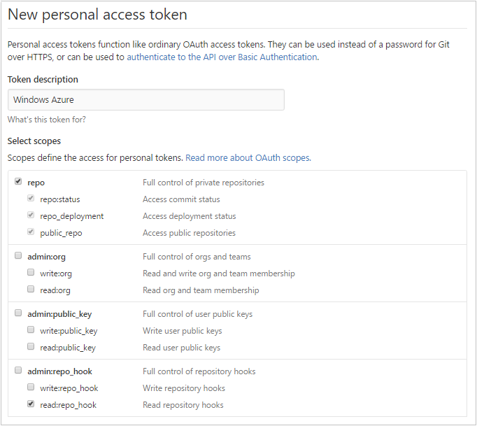

   - Click **Generate token**

   - Copy the token

2. Add the GitHub Token to Azure in the Azure Resource Explorer

   - Open [https://resources.azure.com/providers/Microsoft.Web/sourcecontrols/GitHub](https://resources.azure.com/providers/Microsoft.Web/sourcecontrols/GitHub) in your web browser.

   - Log in with your Azure account.

   - Selected the correct Azure subscription.

   - Select **Read/Write** mode.

   - Click **Edit**.

   - Paste the token into the **token parameter**.

     

   - Click **PUT**

### Deploy the Azure Components

1. Fork this repository to your GitHub account.

2. Click the Deploy to Azure Button:

   

3. Fill in the values in the deployment page and select the **I agree to the terms and conditions stated above** checkbox.

### Handle Error

# Follow-up Steps

### Add Reply URL and Admin Consent Bot Web App

1. Get the URL of the Web app, and change the schema to http**s**, we will get a base URL.

    For example: `https://huddle-bot-dev.azurewebsites.net`

2. Append `/` to the base URL, we will get the replay URL. 

   For example: `https://huddle-bot-dev.azurewebsites.net/`

   Add it the Bot App Registration.

3. Append `/admin/consent` to the base URL, we will get the admin consent URL.

   For example: `https://huddle-bot-dev.azurewebsites.net/admin/consent`

   Open it in a browser, sign in with an admin account.

   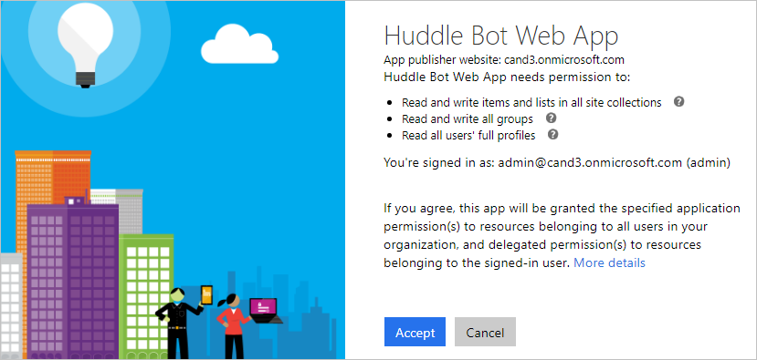

   Click **Accept**.

### Add Reply URL and Admin Consent Metric Web App

Follow the similar steps in previous chapter to add the reply URL and admin consent. 

### Authorize Planner API Connection

Authorize

### Authorize Teams API Connection

Follow the similar steps in previous chapter to authorize teams API Connection

### Authorize Microsoft Graph API Connection

### Update Bot Messaging Endpoint

Add 

## Team App

### Add Bot

### Add Metric Input Tab

1. Create Teams App package
2. Sideload package 
3. Add tab

### Add Idea Board Tab

### 

